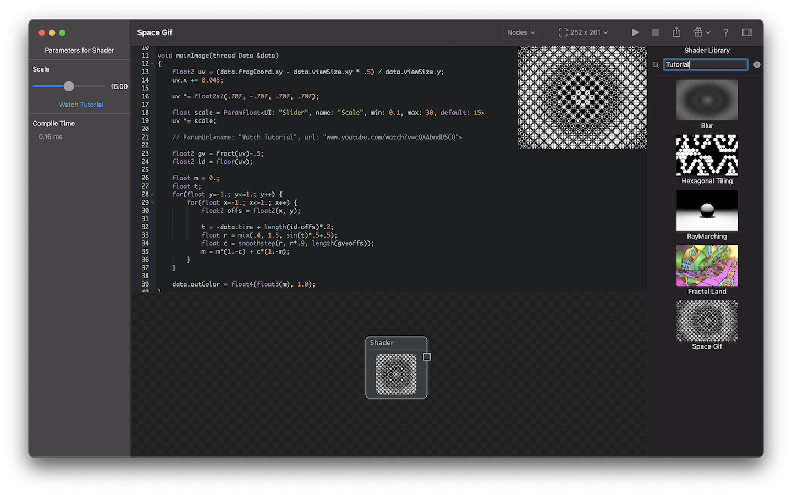

# ShaderMania

## 2023 Update

I am currently working on v2 which should come out later this year.

Please also check out my other Metal shader related product: [Render-Z](https://github.com/markusmoenig/Render-Z). 

The below text references v1 which is the version in the AppStore.

## Create, edit, share and learn about Metal shaders on macOS and iOS

ShaderMania features live coding of Metal fragment shaders with realtime preview and playback. Shaders are displayed as nodes which can be connected as needed.

ShaderMania features a database of public shaders including tutorial shaders with links to explanation videos.

For the iOS version a physical keyboard is recommended for coding shaders.

Features

* Flexible node system supporting Shaders and Images. Named input slots for shaders can be created inside the shader source code.
* Connect shader nodes to be able to chain shaders.
* Optional abstracted parameter definition which supports display of variables as sliders to live change shader values in the user interface.
* Tutorial shaders can display a button with a link to their video urls.
* Realtime syntax check and compilation of your shaders with realtime preview.
* Render to custom resolutions and export your shader output to PNG.
* Display of syntax errors and warnings.

Database

* Upload your shaders to the public shader database
* Browse shaders in the Database and learn / experiment.
* Add the nodes of shaders in the database to your project.

## Acknowledgements

* Thanks to [The Art of Code](https://www.youtube.com/channel/UCcAlTqd9zID6aNX3TzwxJXg) for allowing me to use his tutorial shaders.
* Thanks to [Kali](https://www.shadertoy.com/user/Kali) for allowing me to use his [Fractal Land](https://www.shadertoy.com/view/XsBXWt) shader for the app.
