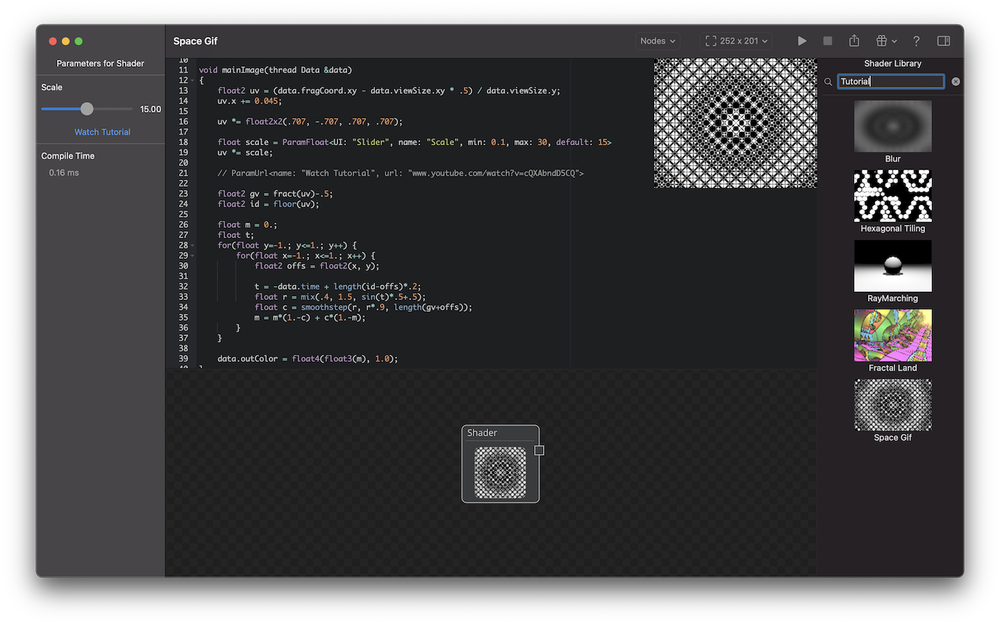

# ShaderMania

[](https://apps.apple.com/us/app/shadermania/id1541065830)

[](https://lbesson.mit-license.org/) [](https://shields.io/) [](https://discord.gg/BMStWPhByj) [](https://twitter.com/markusmoenig)




## Create, edit, and share Metal shaders on macOS and iPadOS

ShaderMania features live coding of Metal fragment shaders with realtime preview and playback. Shaders are displayed as nodes which can be connected as needed.

ShaderMania features a database of public shaders including tutorial shaders with links to explanation videos.

A physical keyboard is recommended for coding shaders.

## ShaderMania Pro

ShaderMania Pro is the paid, timeline-based path tracing version for macOS. It adds procedural SDF objects, full OpenPBR materials, cameras, lights, image tracks, post effects, still export, and frame-accurate video export.

[Download ShaderMania Pro on the App Store](https://apps.apple.com/th/app/shadermania-pro/id6764767974?mt=12)

## Features

* Flexible node system supporting Shaders and Images. Named input slots for shaders can be created inside the shader source code.
* Connect shader nodes to be able to chain shaders.
* Optional abstracted parameter definition which supports display of variables as sliders to live change shader values in the user interface.
* Tutorial shaders can display a button with a link to their video urls.
* Realtime syntax check and compilation of your shaders with realtime preview.
* Render to custom resolutions and export your shader output to PNG.
* Display of syntax errors and warnings.
* Undo and redo for common project edits such as adding, deleting, renaming, moving, and connecting nodes.

## Shader Library

* Upload your shaders to the public shader database
* Browse shaders in the Database and learn / experiment.
* Add the shader nodes from the database to your project.

The public library is intended for useful, inspectable shader examples. Placeholder/default projects and incomplete metadata should not be uploaded.

## Development

The repository includes a small Swift Package test target for core non-UI logic:

```sh
swift test
```

## How to help

Rating or reviewing ShaderMania in the AppStore is a great help as it improves visibility.

## Acknowledgements

* Thanks to [The Art of Code](https://www.youtube.com/channel/UCcAlTqd9zID6aNX3TzwxJXg) for allowing me to use his tutorial shaders.
* Thanks to [Kali](https://www.shadertoy.com/user/Kali) for allowing me to use his [Fractal Land](https://www.shadertoy.com/view/XsBXWt) shader for the app.
